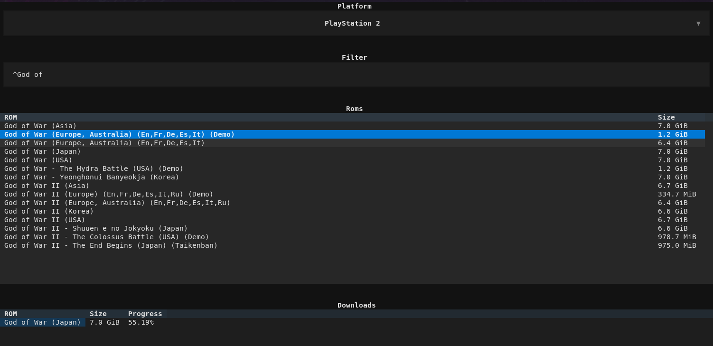

# Rom Archives

## Objectifs

Développer un outils qui va permettre de lister toutes les roms disponibles sur une plateforme.
L'utilisateur devra pouvoir:

    - Choisir une plateforme
    - Voir toutes les roms disponibles
    - Utiliser un filtre pour limiter les résultats
    - Ajouter une rom à la liste des téléchargements
    - Savoir si une rom a déjà été téléchargée
